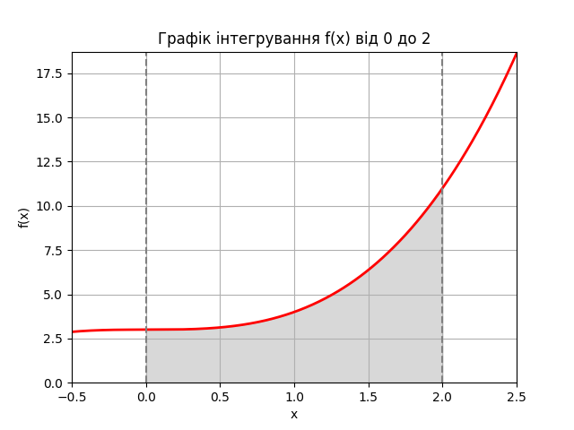

## Обрана функція
Функція для інтегрування:

f(x) = x^3 + 3

Межі інтегрування:

a = 0
b = 2

## Графічне представлення

Для наочності побудовано графік функції та виділено площу під кривою (сіра зона), яка відповідає значенню інтеграла.

 

## Методи обчислення
1. **Аналітичне інтегрування**  
   Виконано вручну, інтеграл дорівнює:

∫(0 to 2) (x^3 + 3) dx = 10.0

2. **Метод Монте-Карло**  
Використано генерацію випадкових точок для оцінки площі під кривою:

Інтеграл методом Монте-Карло ≈ 9.9961

3. **Функція scipy.integrate.quad**  
Використано для перевірки точності:

Інтеграл: 10.0, оцінка абсолютної похибки: 1.11e-13

## Порівняння результатів
| Метод | Результат | Відхилення від аналітичного |
| --- | --- | --- |
| Аналітичне обчислення     | 10.0           | 0                          |
| Метод Монте-Карло         | 9.9961         | 0.0039                     |
| SciPy quad                | 10.0           | 1.11e-13                   |

## Висновки
- **Метод Монте-Карло** дав результат, близький до аналітичного (похибка менше 0.04%).  
- Функція **quad** з SciPy підтвердила точність аналітичного обчислення.  
- Метод Монте-Карло є ефективним для наближених обчислень інтегралів, особливо коли аналітичне рішення складне або неможливе.  
- Невелика різниця між результатами є наслідком випадковості генерації точок у методі Монте-Карло.  

Метод Монте-Карло показав високу точність при достатній кількості точок і може бути застосований для чисельного інтегрування складних функцій.

